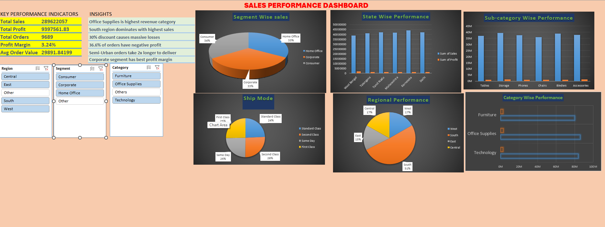

1# 📊 Sales Performance Analysis — Excel Dashboard Project

## Project Overview

This project analyses sales performance data from an Indian retail business using Microsoft Excel.
The goal is to uncover insights around revenue, profitability, regional performance, customer
segments, and shipping patterns across 9,689 orders using Pivot Tables and an interactive dashboard.

---

## Tools Used

- **Microsoft Excel** — data cleaning, pivot tables, dashboard
- **Pivot Charts** — bar charts, pie charts, column charts
- **Slicers** — interactive filtering by Region, Segment, and Category

---

## Dataset

| Field | Detail |
|-------|--------|
| Source | raw_data.csv |
| Total Orders | 9,689 |
| Total Records | 10,350 rows |
| Columns | 13 (Order ID, Ship Mode, Segment, Region, Category, Sales, Profit, etc.) |
| Country | India |

---

## Dashboard Preview



---

## Key Performance Indicators

| Metric | Value |
|--------|-------|
| Total Sales | ₹289,622,057 |
| Total Profit | ₹9,397,561.83 |
| Total Orders | 9,689 |
| Profit Margin | 3.24% |
| Avg Order Value | ₹29,891.84 |

---

## Key Findings

### 🏷️ Category Performance
- **Office Supplies** is the highest revenue category
- **Technology** has the strongest profit margin relative to sales
- **Furniture** generates high sales but contributes least to profit

### 🌍 Regional Performance
- **South region dominates** with 51% of total sales
- West and Central regions each hold 17% share
- East region contributes 15% of total sales

### 👥 Customer Segments
- All 3 segments are nearly equal — Consumer (34%), Home Office (33%), Corporate (33%)
- **Corporate segment has the best profit margin**
- Consumer segment drives the highest volume of orders

### 🚚 Shipping
- **Standard Class** is the most used ship mode at 24%
- Same Day and Second Class are equally popular at 25–26%
- **Semi-Urban orders take 2x longer to deliver** than urban orders
- First Class accounts for 24% of shipments

### 📍 State Performance
- **West Bengal, Telangana, Tamil Nadu, Maharashtra, Karnataka, and Delhi** are the top performing states
- Maharashtra and Karnataka show strong sales volume

### ⚠️ Problem Areas
- **30% discount causes massive losses** — heavy discounting is destroying profitability
- **36.6% of orders have negative profit** — more than 1 in 3 orders loses money
- Profit margin of only **3.24%** is dangerously low and needs urgent attention

---

## Business Recommendations

1. **Eliminate discounts above 20%** — 30%+ discounts are generating net losses on a third of all orders
2. **Focus on South region** — already the strongest market, worth further investment
3. **Prioritise Technology category** — best margins, should be pushed over Furniture
4. **Investigate Semi-Urban delivery delays** — 2x longer delivery times hurt customer satisfaction
5. **Review Corporate segment strategy** — best margins, yet equal volume to other segments; targeted campaigns could grow this further

---

## Excel Skills Demonstrated

- Data cleaning and formatting
- Pivot Tables for multi-dimensional analysis
- Pivot Charts (pie, bar, column)
- Interactive slicers for Region, Segment, and Category filtering
- KPI summary cards
- Dashboard design and layout

---

## Project Structure

```
Sales-Performance-Analysis/
│
├── Sales_Performance.xlsx    # Full workbook with dashboard and pivot tables
├── raw_data.csv              # Raw dataset
├── Dashboard.png             # Dashboard screenshot
└── README.md                 # This file
```

---

## Author

**Tarib Choudhury**
Aspiring Data Analyst | SQL • Excel • Power BI | India
📧 taribchoudhury@gmail.com
